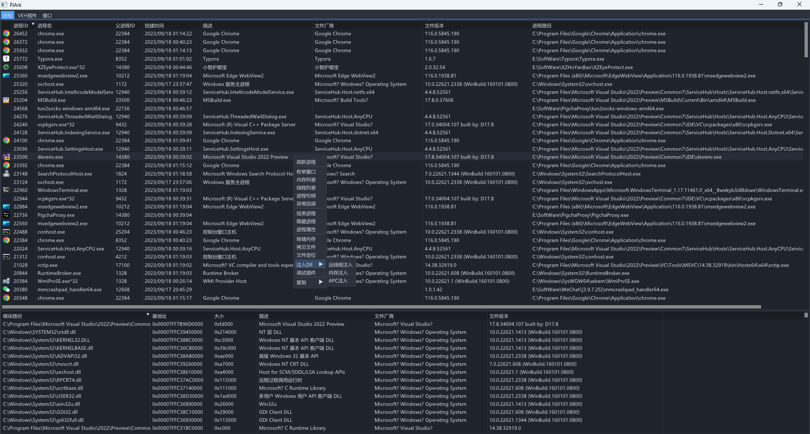
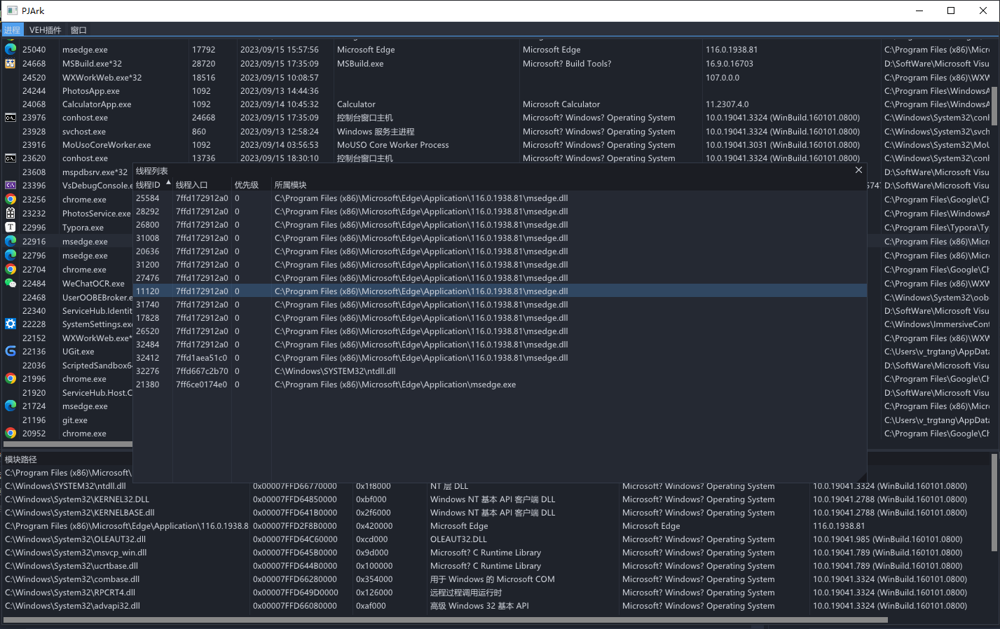
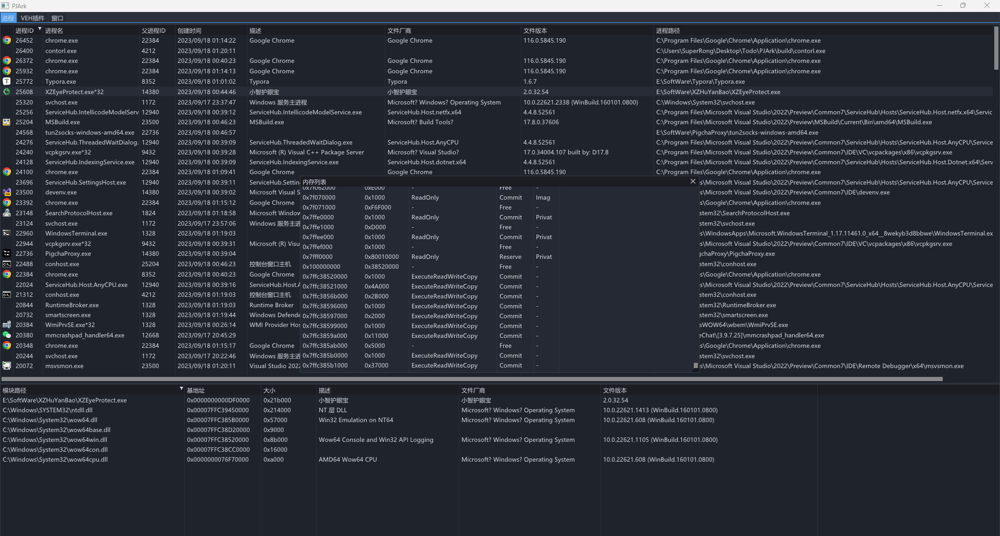
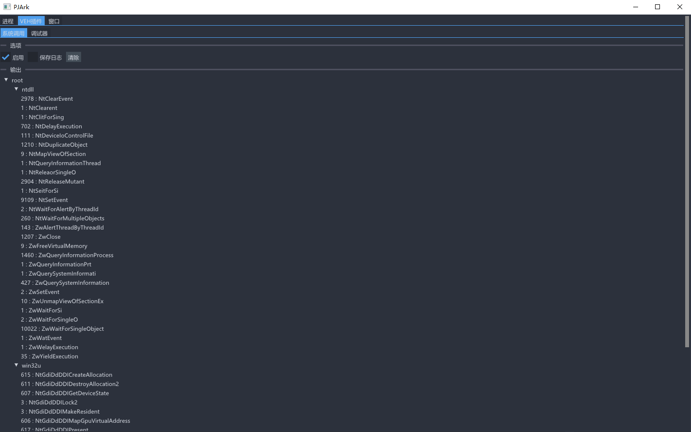
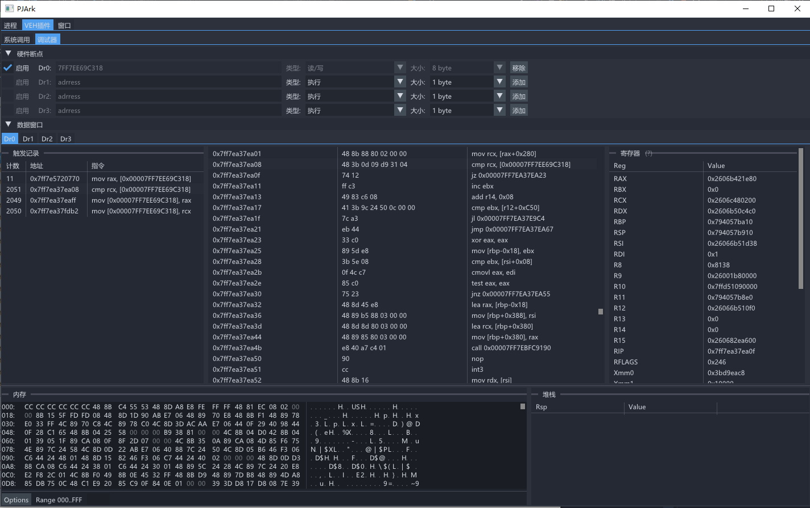
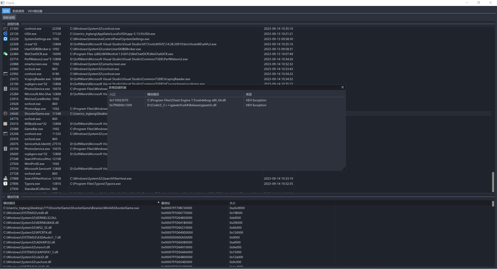

# 介绍

嗨嗨嗨，一个基于IMGUI界面的ark！！！！！！

目前还在开发中，代码非常糟糕，且都为R3层的实现。

疯狂CV抄代码，哪里需要抄哪里，哪里出问题换哪里！！！

目前的功能：

1）、进程、线程、内存、异常回调遍历

2）、结束进程、进程属性

3）、文件定位

4）、注入dll、调试插件、复制

# 截图

## 进程/模块遍历

## 线程列表

## 内存列表

## 基于CallBack的Syscall监控

## 硬件调试（CE F5功能）

## VEH异常表查询

# TODO

1、极致优化代码，提高效率。

2、添加模拟器。

3、完善进程列表右键菜单功能。

4、添加窗口页面，右键进程，选择窗口时，自动跳转到窗口页面。

5、进程、内存、线程属性更换为PEB获取（为了兼容之后换R0）

# 更新日志

<<<<<<< HEAD
- 2023/09/21

1、修复VEH回调获取乱码。

=======
>>>>>>> c87b23f89f3c7e08c740a0e314fae1d746bd8164
- 2023/09/20

1、优化插件注入逻辑，修复调试器关闭重启后无法对目标进程注入。

- 2023/09/19

1、触发记录、反汇编窗口添加右键复制菜单；修复内存窗口显示地址错误。

2、添加堆栈窗口数据，且添加基质注释。

- 2023/09/16-2023/09/18

1、添加文件定位功能、复制、注入DLL（远线程）

2、读内存封装为模块，方便日后移植。

3、内存遍历

- 2023/09/15

1、修复线程、VEH窗口切换窗口时消失问题。

2、封装重复性代码。

3、重写、优化一堆逻辑，重点修复VEH调试器（切换新进程时，自动清理上一个进程的环境）。

4、进程列表添加文件描述、文件厂商、文件版本号字段。

- 2023/09/14

1、修复可执行硬件断点无效。

2、修复模块列表中存在乱码。

- 2023/09/13

1、添加进程图标显示，Dx12->Dx11。

2、添加模块列表、线程列表、VEH异常表查询。

3、修复硬件断点，判断当前断点来自哪一个Dr寄存器。

4、硬件断点由设置主线程修改为设置所有线程。

