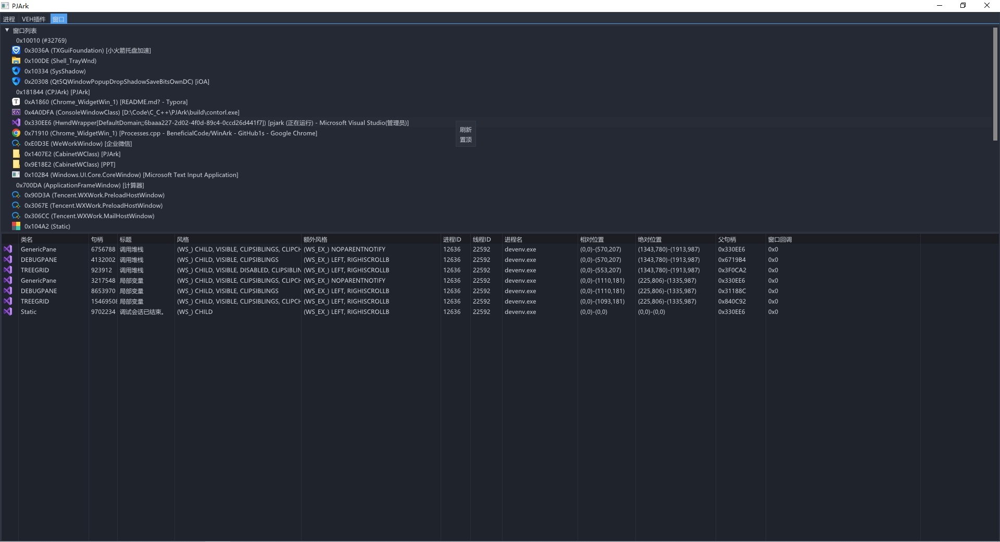

嗨嗨嗨，一个基于IMGUI界面的ark！！！！！！

目前还在开发中，代码非常糟糕，且都为R3层的实现。

疯狂CV抄代码，哪里需要抄哪里，哪里出问题换哪里！！！

# 介绍

工具定位是分析游戏为主。

✔：已实现

🟢：待开发

# **计划功能**

## **常规**

 ● 进程信息✔

 ● 模块信息✔

 ● 线程信息✔

● 异常信息✔

● 内存信息✔

● 句柄表🟢

● 窗口信息✔

● 钩子扫描（IAT、EAT、Inline、消息钩子）🟢

● 对目标进程任意Hook后，使用UI编写Lua脚本进行数据处理🟢

● 待定.....

## **分析**

### **调试器**

暂定为这个名字，后期可能会修改名字

● syscall调用记录✔

● CE-VEH对地址查找访问功能✔

● 待定......

# 截图

## 进程/模块遍历

## 线程列表

## 内存列表

## 基于CallBack的Syscall监控

## 硬件调试（CE F5功能）

## VEH异常表查询

# 窗口枚举

# TODO

1、内存区域显示数据规划。

2、极致优化代码，提高效率。

3、添加模拟器。

5、进程、内存、线程属性更换为PEB获取（为了兼容之后换R0）

6、针对调试器方面，后期计划使用lua脚本配合硬件调试做数据处理。

7、进程扫描（进行中）

# 更新日志

- 2023/11/8

1、添加x64 inline hook,支持相对地址。

2、veh插件添加hook。

- 2023/11/1

1、设计PE类

2、添加icon

3、添加lua脚本引擎

4、添加lua编辑页面

- 2023/10/31

1、优化代码

2、添加内存dump。

- 2023/10/11

1、史诗级 整理/优化 代码。

- 2023/10/10

1、窗口遍历添加 相对/绝对位置、右键菜单添加 刷新、置顶功能。

2、进程列表添加命令行数据，右键菜单添加 挂起、恢复进程。

- 2023/10/09

1、添加窗口遍历（相对/绝对位置待添加）。

- 2023/09/28

1、分类widget

- 2023/09/22-2023/09/24

1、完善调试器反汇编窗口跳转地址时自动切换到对应的内存页。

2、完善进程列表右键菜单功能(内核功能除外)。

3、优化代码。

- 2023/09/21

1、修复VEH回调获取乱码。

2、完善反汇编窗口（以4kb为块，滚动越界后切换下一块汇编）、添加反汇编右键跳转到地址。

3、优化调试器代码逻辑。

- 2023/09/20

1、优化插件注入逻辑，修复调试器关闭重启后无法对目标进程注入。

- 2023/09/19

1、触发记录、反汇编窗口添加右键复制菜单；修复内存窗口显示地址错误。

2、添加堆栈窗口数据，且添加基质注释。

- 2023/09/16-2023/09/18

1、添加文件定位功能、复制、注入DLL（远线程）

2、读内存封装为模块，方便日后移植。

3、内存遍历

- 2023/09/15

1、修复线程、VEH窗口切换窗口时消失问题。

2、封装重复性代码。

3、重写、优化一堆逻辑，重点修复VEH调试器（切换新进程时，自动清理上一个进程的环境）。

4、进程列表添加文件描述、文件厂商、文件版本号字段。

- 2023/09/14

1、修复可执行硬件断点无效。

2、修复模块列表中存在乱码。

- 2023/09/13

1、添加进程图标显示，Dx12->Dx11。

2、添加模块列表、线程列表、VEH异常表查询。

3、修复硬件断点，判断当前断点来自哪一个Dr寄存器。

4、硬件断点由设置主线程修改为设置所有线程。

